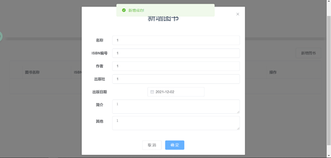

# 图书管理系统

图书管理系统是一个后台前端解决方案，前端基于vue和element-ui实现。后端基于node

### 开发环境

- 前端:vue、axios
- 后端:node.js、express
- 数据库:mysql

### 启动项目

~~~bash
//前端
cd client

npm i

npm start
//后端
cd back

npm i

npm start
~~~

### 效果图

# book-curd-example
"# book-curd-example" 
